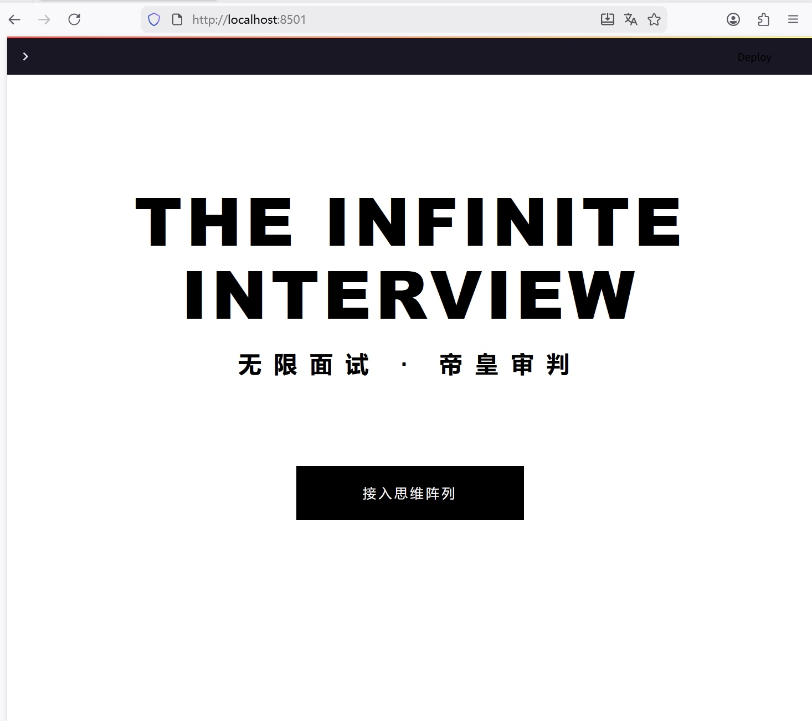
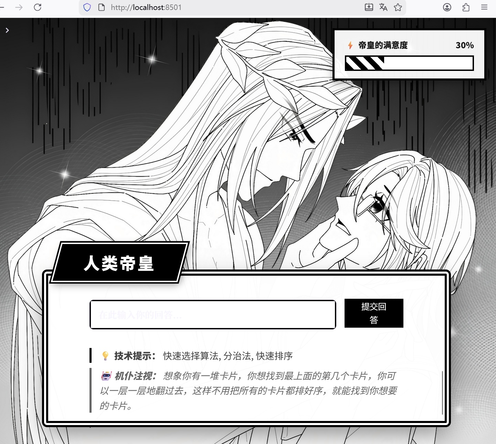
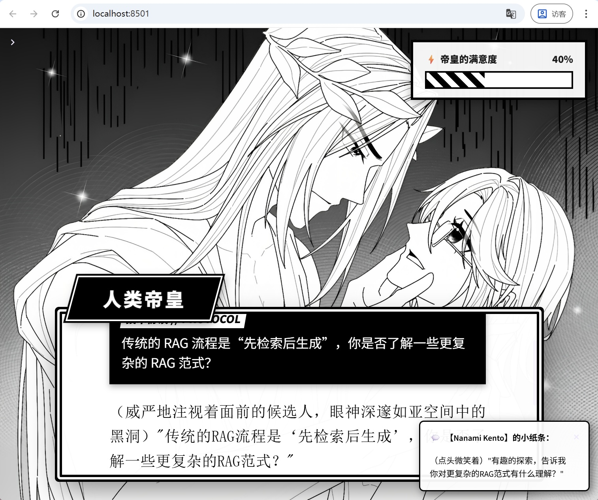

# Love & Code 面试系统 (The Infinite Interview)

[中文](#中文) | [English](#english)

---

## <a id="中文"></a>中文版

**沉浸式角色扮演面试演练系统**

本项目是从企业级多智能体 RAG 系统项目 [Aegis-Isle] 剥离出的独立核心子系统，主要用于展示在 Agent 工作流模型、LangGraph 流程控制、LLM 结构化响应生成以及情景化 RAG 方面的技术储备。它将枯燥的“刷八股文”重塑成了带有“跑团/视觉小说”属性的角色扮演级面试体验。

### 📸 界面截屏演示

<div align="center">
  
  <br>
  <em>极简主义的启航页：「接入思维阵列」</em>
</div>

<div align="center">
  
  <br>
  <em>主面试官（如：人类帝皇）的压迫感技术提问与动态满意度条</em>
</div>

<div align="center">
  
  <br>
  <em>双轨制辅导：回答输入区与后台导师（如：七海建人）提供的破题思路与通俗类比</em>
</div>

### 🎯 核心技术与架构能力展示

通过分析这份代码，招聘方可以验证以下核心能力栈：

1. **复杂 Agent Workflow 实现能力 (LangGraph)**
   - 使用 `langgraph` 从零实现状态图 (StateGraph)，实现了完整的双节点循环（`generate_node` 生成问题，`evaluate_node` 判卷打分）。
   - 实现条件路由编排（正确 -> 由 Mentor 进行知识深化扩展，错误 -> 由 Tutor 利用 ELI5 原则拆解讲解）。
2. **LLM 结果结构化控制与双重对话编排 (Polyphonic Prompting)**
   - 自定义封装 `LLMGenerator`，利用结构化 Prompting 将非确定性输出稳定约束为 JSON。
   - 实现主面试官与场外导师的“高并发双声道生成”（`generate_dual_question_interaction`），通过 `asyncio` 异步提高生成吞吐率。
3. **记忆遗忘曲线与 RAG (Knowledge Engine)**
   - 融合艾宾浩斯记忆原理（Box 机制，按 1/3/7/14/30 天周期调度），打造了智能化的 `get_next_question` 推荐算法，综合了失败惩罚、历史答题率等因素。
   - 内置轻量级文件处理流程，利用 LangChain 配合 LLM 对目标 JD （Job Description）和业务知识文档（KB）自动切割、生题、去重、入库。
4. **个性化 Persona 系统设计**
   - 完整适配并接入了开源社区成熟的 `SillyTavern` (V2) 和 PNG 角色隐写卡片格式，具备处理解析超长 World Lore (世界设定薄) 并融合到技术解答中的能力。

### 🌲 与父项目 Aegis-Isle 的血统关联

`Love-and-Code-Interview` 原为 **[Aegis-Isle 系统]** （一个提供数据分析与企业知识管理的 Multi-Agent 协作网络）的辅助子模块 `interview/`：
- **RAG 引擎共用**：在此孤岛项目中保留了 `aegis_isle.rag` 中对于文件加载、Chunking 以及基础生成等核心功能。
- **降级依赖**：原版运行强依赖于 Aegis 中的向量数据库 (Qdrant) 与中枢数据总线。当前版本为了在 GitHub 进行个人能力展示，将所有动态数据流改造为可落盘的无状态 JSON 以实现 `Zero-Config`。

### ⚡ 快速启动指南

此项目设计为可一键运行，无需额外搭建数据库：

#### 1) 环境要求
* 建议安装 Python 3.10+

#### 2) 下载与安装
```bash
git clone https://github.com/gabby1111111111/Love-and-Code-Interview.git
cd Love-and-Code-Interview

# 建议在虚拟环境中运行
python -m venv .venv

# Windows 激活方式:
.venv\Scripts\activate
# Linux/Mac 激活方式:
# source .venv/bin/activate

pip install -r requirements.txt
```

#### 3) 必要的配置 (.env)
在项目根目录创建一个 `.env` 文件，输入你的大模型密钥（默认兼容 OpenAI/DeepSeek 等标准库）：
```env
LLM_PROVIDER=openai
OPENAI_API_KEY=sk-xxxxxxxxxxxxxxxxxxxxxxxxxx

# 可随意指定使用的底层大模型名称
DEFAULT_LLM_MODEL=gpt-4-turbo
```

#### 4) 一键启动！
```bash
python scripts/run_interview_app.py
```
> 若出现路径引入异常，本脚本会自动修改 PYTHONPATH 指向 `src/` 以纠正 Python 的环境寻找。

### 📂 仓库全貌导航
```text
.
├── data                        -> 数据持久化 (人物卡片 / 题库 / 图像资源)
├── default                     -> 初始化自带的默认配置模版文件
├── frontend
│   └── interview_app.py        -> 基于 Streamlit 撰写的全屏视觉小说 UI 呈现层
├── logs                        -> Loguru 日志切割与异常追溯存档
├── scripts                     -> 维护工具与项目启动脚本
└── src
    └── aegis_isle
        ├── core                -> Base Utils (Logging, Base Configs)
        ├── interview           -> 本次剥离出的核心 (Knowledge, Persona, LangGraph, LLM)
        └── rag                 -> 父工程底层模块 (LLMGen, TextSplitter, Event等依赖支持)
```

### 💡 开发规划 / To-Do

1. 接入 **DeepSeek-R1** 专门用于逻辑判决与思考（`evaluate_node` ）。
2. 将 `st.session_state` 持久化迁移到 SQLite，增强长时间会话记忆回溯。
3. 提供 Dockerfile，支持云平台 `Render / HuggingFace Spaces` 秒级部署。

---

## <a id="english"></a>English

**An Immersive Role-Playing Interview System**

This project is an independent core subsystem extracted from the enterprise-grade multi-agent RAG system [Aegis-Isle]. It showcases advanced Agent workflows, LangGraph logic routing, LLM structured JSON generations, and situated RAG capabilities. It re-imagines the boring code-interview preparation into a table-top RPG / Visual Novel styled immersive experience.

### 📸 Interface Showcases

<div align="center">
  
  <br>
  <em>Minimalist welcome terminal: "Enter the Thought Array"</em>
</div>

<div align="center">
  
  <br>
  <em>The intimidating main interviewer (e.g. The Emperor) asking complex technical questions with a dynamic satisfaction bar</em>
</div>

<div align="center">
  
  <br>
  <em>Dual-track coaching system: Answer input field backed by hints and ELI5 analogies from your tutor</em>
</div>

### 🎯 Core Features & AI Engineering Capabilities

By reviewing this repository, recruiters can verify the following capabilities:

1. **Complex Agent Workflows (LangGraph)**
   - Developed a complete `StateGraph` using `langgraph` from scratch, enabling a dual-node cycle (`generate_node` & `evaluate_node`).
   - Implemented conditional routing: (Correct -> Extends knowledge with a Mentor; Incorrect -> Breaks down concepts via ELI5 with a Tutor).
2. **LLM Output Structuring & Polyphonic Prompts**
   - Managed structural LLM generation constraining output reliably to JSON across arbitrary language models.
   - Built a concurrent "Dual-Channel Dialogue" (`generate_dual_question_interaction`) via `asyncio`, where an Interviewer and a Tutor generate synchronized lore actions simultaneously to boost token throughput.
3. **Spaced Repetition & Contextual RAG (Knowledge Engine)**
   - Infused the Ebbinghaus Forgetting Curve into question recommendation (`get_next_question` algorithms), integrating failure penalties and historical correctness rates.
   - Designed a document processing pipeline via LangChain to auto-chunk arbitrary Job Descriptions (JD) and Knowledge Bases (KB) into unique, deduplicated JSON interview challenges.
4. **Persona Design Integration**
   - Handled `SillyTavern` (V2) JSON and PNG steganography formats. Extracts expansive "World Lore" from characters to dynamically flavor technical questions and explanations.

### 🌲 Relationship with 'Aegis-Isle'

`Love-and-Code-Interview` was originally the `interview/` sub-module inside the **[Aegis-Isle System]** (A Multi-Agent collaboration network for enterprise data analysis).
- **Shared RAG Engine**: Retained base generation, file loaders, and chunking modules from `aegis_isle.rag`.
- **Degraded Dependencies**: The main project relies heavily on Qdrant vector spaces and an event bus. To present a zero-config repository for GitHub showcases, all active external storages were replaced by stateless local JSON files.

### ⚡ Quick Start

This project runs out of the box with zero external database setups.

#### 1) Prerequisites
* Python 3.10+ recommended

#### 2) Installation
```bash
git clone https://github.com/gabby1111111111/Love-and-Code-Interview.git
cd Love-and-Code-Interview

python -m venv .venv

# Windows Activation:
.venv\Scripts\activate
# Linux/Mac Activation:
# source .venv/bin/activate

pip install -r requirements.txt
```

#### 3) Environment Variables (.env)
Create a `.env` in the root and configure your preferred LLM provider API Key (OpenAI API standard compatible):
```env
LLM_PROVIDER=openai
OPENAI_API_KEY=sk-xxxxxxxxxxxxxxxxxxxxxxxxxx

DEFAULT_LLM_MODEL=gpt-4-turbo
```

#### 4) Run!
```bash
python scripts/run_interview_app.py
```
> The startup script auto-prepends `src/` into your PYTHONPATH if no packages are globally installed.

### 📂 Repository Overview
```text
.
├── data                        -> Data persistence (Personas / Questions / Graphics)
├── default                     -> Default pre-loaded test scenario environments
├── frontend
│   └── interview_app.py        -> Full-screen Visual Novel UI using Streamlit
├── logs                        -> Loguru rotations & audit trails
├── scripts                     -> Launch tools
└── src
    └── aegis_isle
        ├── core                -> Base Logging & settings
        ├── interview           -> Core isolated features (Knowledge, Persona, LangGraph)
        └── rag                 -> Base Aegis dependencies (LLMGen, TextSplitters, etc.)
```

### 💡 To-Do Roadmap

1. Implement **DeepSeek-R1** specifically for logical deduction in `evaluate_node`.
2. Migrate `st.session_state` persistence into SQLite for infinite cross-session memory.
3. Add a Dockerfile for instant `Render / HuggingFace Spaces` deployment.
